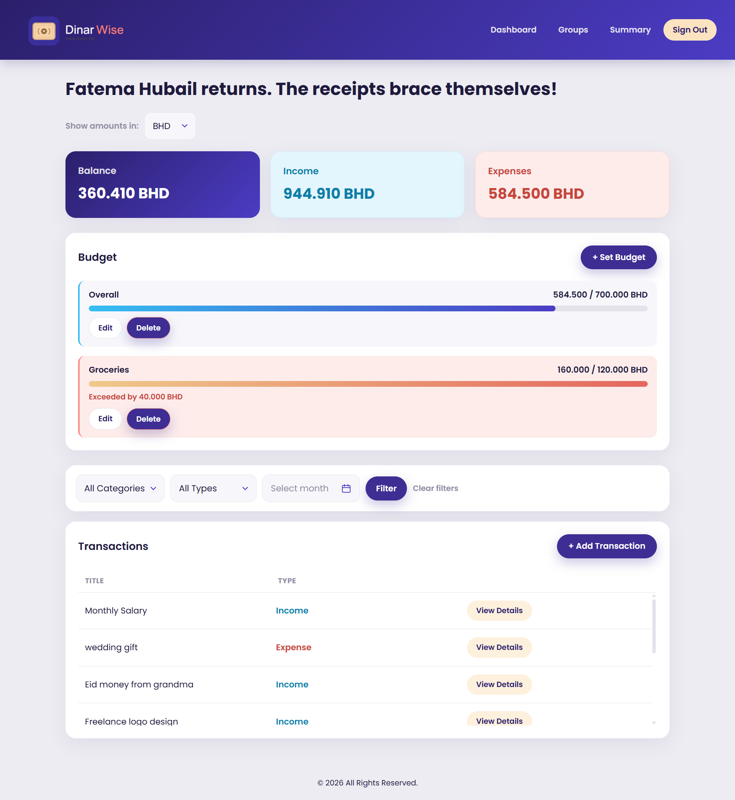
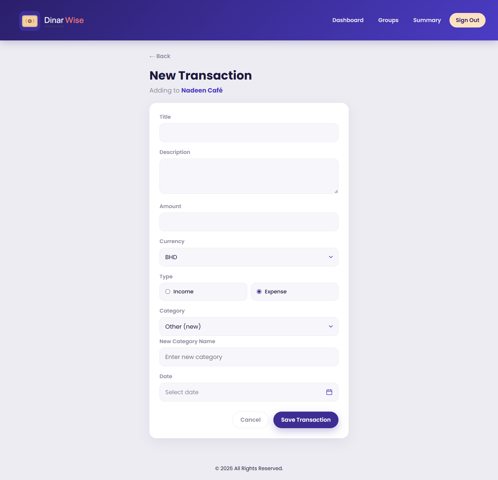
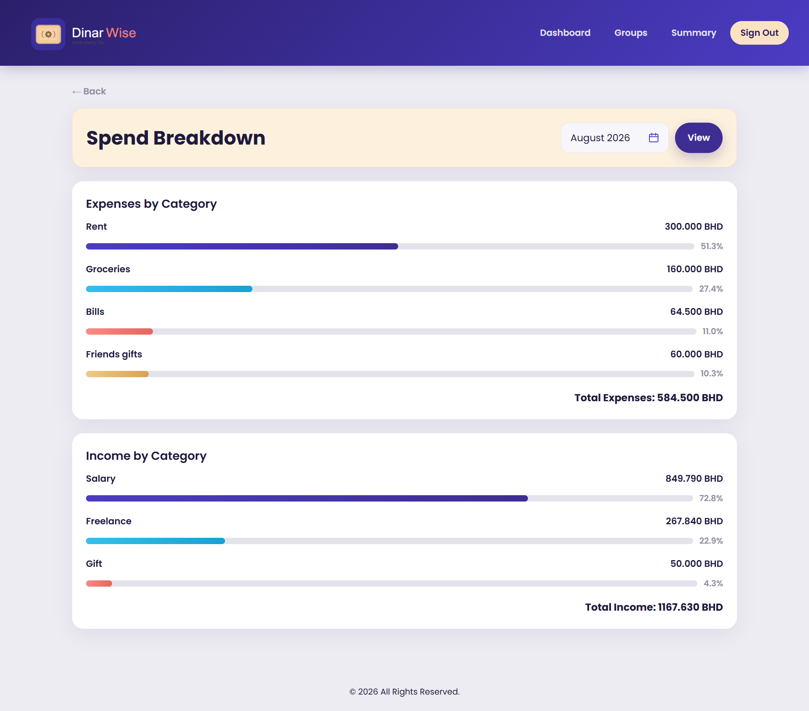
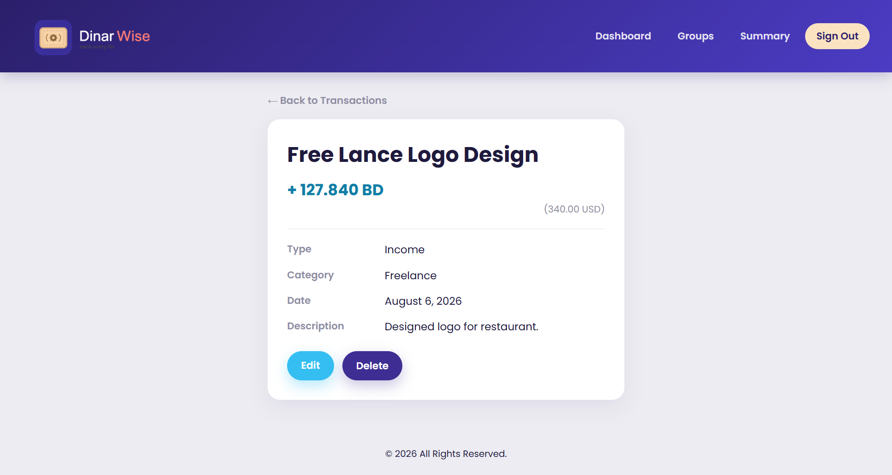
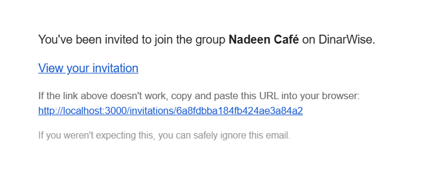
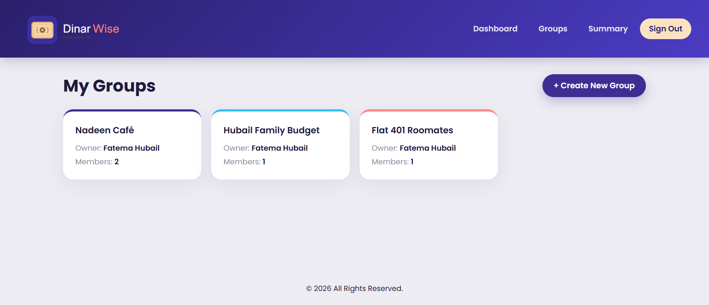
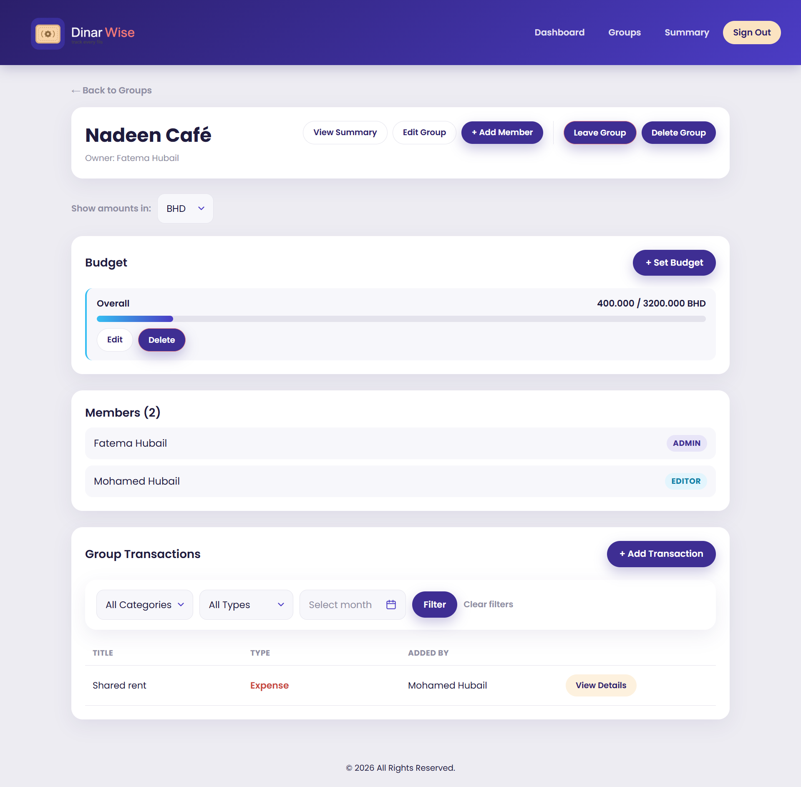

  

<h1 align="center">DinarWise-Budget Tracker Application</h1>

A full-stack CRUD application built with the MEN stack (MongoDB, Express, Node.js, EJS) for tracking personal and shared finances. DinarWise lets you log income and expenses, set monthly budget limits, break spending down by category, and share a budget with groups such as your family members or a small business team using role-based permissions.

  

## Description

DinarWise started as a personal budget tracker and grew into a shared one. Anyone can log their own income and expenses, but the more interesting half of the app is groups: a household splitting rent or a small business tracking supplier costs can share one budget, with each member holding an admin, editor, or viewer role that determines what they're allowed to do.

Amounts are always stored in Bahraini Dinar, but transactions can be entered in any supported currency and are converted on save, with the original amount preserved for reference. Dashboards can also be viewed in any currency, converted at display time.

## Features

**Personal**
- Full CRUD on transactions with income/expense types and 16 built-in categories
- Custom categories: pick "Other", name your own, and it's saved for reuse

  

- Filter your transactions by category, type, and month
- Monthly budget limits, either overall or per category, with exceeded warnings
- Category summary page with totals, percentages, and month selection

  

- Enter transactions in any supported currency; view any dashboard in any currency

  

**Shared (Groups)**
- Create a group and invite members by email

  

- Three roles: admin (full control), editor (add and manage own entries), viewer (read-only)

  

- Shared transaction list showing who added what
- Shared budget limits set by admins
- Group summary page
- Leave a group; ownership transfers automatically if the owner leaves

  

**Security**
- Session-based authentication with hashed passwords
- Every route re-checks ownership and role server-side, not just in the UI
- Data types validations

## Live App

DinarWise is deployed on Render, Sign Up and give it a try:

**[dinarwise.com](https://budget-tracker-application-bg4o.onrender.com)**

## User Stories

### Authentication
- AAU, I can sign up with an email, username, and password so I can create my own account.
- AAU, I can sign in so I can access my transactions.
- AAU, I can sign out so my session ends securely on shared devices.

### Transactions (CRUD)
- As a logged-in user, I can view a list of all my transactions so I can see my financial activity at a glance.
- As a logged-in user, I can add a new transaction so I can record income or expenses.
- As a logged-in user, I can view the details of a single transaction so I can review its full information.
- As a logged-in user, I can edit an existing transaction so I can correct mistakes or update details.
- As a logged-in user, I can delete a transaction so I can remove entries I no longer want tracked.

### Categories
- As a logged-in user, I can choose from a fixed list of categories so my spending stays consistently labelled.
- As a logged-in user, I can only see categories that match the type I picked, so income and expense options don't mix.
- As a logged-in user, I can create my own category when none of the built-in ones fit, so unusual expenses are still tracked properly.
- As a logged-in user, I can reuse a custom category I created earlier, so I don't have to retype it every time.

### Balance & Overview
- As a logged-in user, I can see my total balance, income, and expenses on the dashboard so I know my financial standing at a glance.
- As a logged-in user, I can distinguish income entries from expense entries visually so I can quickly scan my transaction list.

### Filtering & Search
- As a logged-in user, I can filter my transactions by category so I can see how much I've spent or earned in a specific area.
- As a logged-in user, I can filter my transactions by type so I can focus on one side of my finances.
- As a logged-in user, I can filter my transactions by month so I can review a specific period.
- As a logged-in user, I can clear all filters at once so I can get back to the full list.

### Category Summary
- As a logged-in user, I can see total spending per category so I understand where my money goes.
- As a logged-in user, I can see what percentage of my spending each category represents so I can spot my biggest costs.
- As a logged-in user, I can choose which month the summary covers so I can compare periods.

### Budgets
- As a logged-in user, I can set an overall monthly spending limit so I have a target to stay within.
- As a logged-in user, I can set a limit for a specific category so I can control problem areas individually.
- As a logged-in user, I can see how close I am to each limit so I can adjust before going over.
- As a logged-in user, I can see a warning when a limit is exceeded so I know to cut back.
- As a logged-in user, I can edit or delete a budget so I can adjust it as my needs change.

### Currency
- As a logged-in user, I can record a transaction in a currency other than BHD so I don't have to convert it myself.
- As a logged-in user, I can see the original amount and currency on a transaction's detail page so I remember what I actually paid.
- As a logged-in user, I can switch which currency my dashboard displays so I can view my finances in whichever currency I'm thinking in.

### Groups
- AAU, I can create a group so I can manage shared finances with others.
- As a group admin, I can invite someone by email so they can join the group.
- As a group admin, I can choose which role an invited person receives so I control what they can do.
- As an invited user, I can accept or decline an invitation so I control which groups I'm part of.
- As a group member, I can see every group I belong to, with its owner and member count, so I can find the right one quickly.
- As a group member, I can rename a group so its name stays accurate.
- As a group admin, I can delete a group so it and its transactions are removed when it's no longer needed.
- As a group member, I can leave a group so I'm no longer tied to its shared finances.
- As a group owner, when I leave, ownership passes to another member so the group isn't left without an owner.

### Shared Transactions & Roles
- As a group admin or editor, I can add a transaction to the group so it's visible to everyone.
- As a group member, I can view all transactions added by anyone in the group so I have full visibility into shared spending.
- As a group member, I can see who added each transaction so contributions are traceable.
- As a group admin, I can edit or delete any transaction in the group so I can correct others' mistakes.
- As a group editor, I can edit or delete transactions I added myself, but not other people's.
- As a group viewer, I can see everything but change nothing, so my access stays read-only.
- As a non-member, I cannot open a group's pages even with a direct link, so private finances stay private.

### Shared Budgets
- As a group admin, I can set a monthly budget limit for the group so we stay within a shared spending plan.
- As a group member, I can see a warning when the group's spending exceeds a limit so everyone is aware.

### Access Control
- AAU, I can only see and manage my own transactions so my financial data stays private.
- As a guest, I am redirected to sign in when trying to access protected routes so my data stays protected.

## Wireframes

[View the wireframes on Excalidraw](https://excalidraw.com/#json=pClzU_7INuY0qqie6G_yc,iPdroI95Rim-nmT0mEH5dw)

## ERD (Entity Relationship Diagram)

  

The app uses six collections. `User` is the parent of everything; `Group` sits alongside it, with membership stored as an embedded array (small and bounded) while transactions reference their group (unbounded and queried independently).

## Technologies Used

- **Node.js** and **Express 5**
- **MongoDB** with **Mongoose**
- **EJS** for server-side templating
- **express-session** and **connect-mongo** for session storage
- **bcrypt** for password hashing
- **method-override** for PUT and DELETE from HTML forms
- **validator** for email validation
- **moment** for date and month-range handling
- **nodemailer** for group invitation emails
- **ExchangeRate-API** for currency conversion
- **morgan** for request logging

## Routes

### Auth
| Method | Route | Description |
|---|---|---|
| GET | `/auth/sign-up` | Sign-up form |
| POST | `/auth/sign-up` | Create account |
| GET | `/auth/sign-in` | Sign-in form |
| POST | `/auth/sign-in` | Authenticate |
| GET | `/auth/sign-out` | End session |

### Transactions
| Method | Route | Description |
|---|---|---|
| GET | `/transactions` | Dashboard: balances, budgets, filters, list |
| GET | `/transactions/new` | New transaction form |
| POST | `/transactions` | Create transaction |
| GET | `/transactions/summary` | Category breakdown |
| GET | `/transactions/:id` | Transaction details |
| GET | `/transactions/:id/edit` | Edit form |
| PUT | `/transactions/:id` | Update transaction |
| DELETE | `/transactions/:id` | Delete transaction |

### Budgets
| Method | Route | Description |
|---|---|---|
| GET | `/budgets/new` | New budget form |
| POST | `/budgets` | Create budget |
| DELETE | `/budgets/:budgetId` | Delete budget |
| GET | `/groups/:id/budgets/new` | New group budget form (admin) |
| POST | `/groups/:id/budgets` | Create group budget (admin) |

### Groups
| Method | Route | Description |
|---|---|---|
| GET | `/groups` | Groups list |
| GET | `/groups/new` | New group form |
| POST | `/groups` | Create group |
| GET | `/groups/:id` | Group detail |
| GET | `/groups/:id/summary` | Group category breakdown |
| GET | `/groups/:id/edit` | Edit group |
| PUT | `/groups/:id` | Update group |
| DELETE | `/groups/:id` | Delete group (admin) |
| DELETE | `/groups/:id/leave` | Leave group |

### Group Transactions
| Method | Route | Description |
|---|---|---|
| GET | `/groups/:id/transactions/new` | New group transaction (admin, editor) |
| POST | `/groups/:id/transactions` | Create group transaction |
| GET | `/groups/:id/transactions/:transactionId` | Group transaction detail |
| GET | `/groups/:id/transactions/:transactionId/edit` | Edit (admin or creator) |
| PUT | `/groups/:id/transactions/:transactionId` | Update (admin or creator) |
| DELETE | `/groups/:id/transactions/:transactionId` | Delete (admin or creator) |

### Invitations
| Method | Route | Description |
|---|---|---|
| GET | `/groups/:id/members/new` | Invite form (admin) |
| POST | `/groups/:id/invite` | Send invitation email |
| GET | `/invitations/:id` | Accept/decline page |
| POST | `/invitations/:id/accept` | Join the group |
| POST | `/invitations/:id/decline` | Decline the invitation |

## Future Features

- **Recurring transactions**:  mark salary or subscriptions as recurring with a weekly, monthly, or yearly frequency
- **Invitation expiry**:  invites currently stay valid until accepted or declined
- **Remove members**: admins can currently invite but not remove
- **Charts**: pie and line visualisations of spending over time
- **Activity feed**: a running log of who changed what in a group

## Attributions

- Exchange rates provided by [ExchangeRate-API](https://www.exchangerate-api.com)
- Built during General Assembly's Software Engineering bootcamp