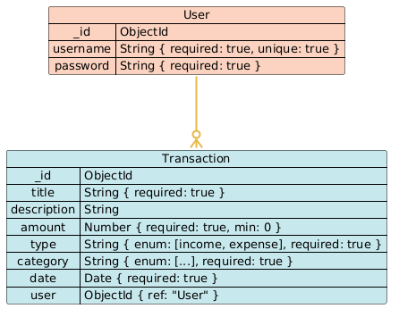

# Budget Tracker

A full-stack CRUD application built with the MEN stack (MongoDB, Express, Node.js) that allows users to track income and expenses, filter and search transactions, and view spending broken down by category.

## Description

Budget Tracker is a personal finance CRUD app where authenticated users can log income and expenses, filter and search through their transaction history, and view a category-based spending summary. Built as part of a General Assembly Software Engineering bootcamp project.

## User Stories

### Authentication
- AAU, I can sign up with a username and password so I can create my own account.
- AAU, I can log in so I can access my personal transactions.
- AAU, I can log out so my session ends securely on shared devices.

### Transactions (CRUD)
- As a logged-in user, I can view a list of all my transactions so I can see my financial activity at a glance.
- As a logged-in user, I can add a new transaction details so I can record income or expenses.
- As a logged-in user, I can view the details of a single transaction so I can review its full information.
- As a logged-in user, I can edit an existing transaction so I can correct mistakes or update details.
- As a logged-in user, I can delete a transaction so I can remove entries I no longer want tracked.

### Balance / Overview
- As a logged-in user, I can see my current total balance (income minus expenses) on the main page so I know my financial standing at a glance.
- As a logged-in user, I can distinguish income entries from expense entries visually (e.g. color or icon) so I can quickly scan my transaction list.

### Filtering & Search
- As a logged-in user, I can filter my transactions by category so I can see how much I've spent or earned in a specific area.
- As a logged-in user, I can filter my transactions by type (income/expense) so I can focus on one side of my finances.
- As a logged-in user, I can filter my transactions by date range (e.g. this month) so I can review a specific period.
- As a logged-in user, I can search transactions using keywords related to transactions details so I can quickly find a specific entry.

### Category Breakdown
- As a logged-in user, I can see a summary of total spending per category so I understand where my money goes.
- As a logged-in user, I can see totals for the current month broken down by category so I can track monthly patterns.

### Access Control
- AAU, I can only see and manage my own transactions (not other users') so my financial data stays private.
- As a guest (not logged in), I am redirected to the login page when trying to access transaction routes so my data stays protected.

---

### (Extra Work)

#### Recurring Transactions
- As a logged-in user, I can mark a transaction as recurring (e.g. monthly salary or subscription) so I don't have to re-enter it every period.
- As a logged-in user, I can set the frequency of a recurring transaction (weekly/monthly/yearly) so it matches my real-life schedule.
- As a logged-in user, I can view and cancel a recurring transaction so I can stop it when it's no longer relevant.

#### Shared Plans (Family/Business Groups)

**Group Management**
- AAU, I can create a group (e.g. family or business) so I can manage shared finances with others.
- As a group owner, I can share my group's unique invite code with others so they can join my group by entering it.
- As an invited user, I can accept or decline a group invite so I control which groups I'm part of.
- As a group owner, I can assign roles (admin/editor/viewer) to members so I can control what each person can do.
- As a group owner, I can remove a member from the group so I can manage who has access.
- AAU, I can leave a group I'm part of so I'm no longer tied to its shared finances.

**Shared Transactions**
- As a group member with editor/admin role, I can add a transaction to the group's shared budget so it's visible to everyone in the group.
- As a group member, I can view all transactions added by anyone in the group so I have full visibility into shared spending.
- As a group member with viewer role, I can see transactions but cannot add, edit, or delete them so my access stays read-only.
- As a group admin, I can edit or delete any transaction in the group so I can correct errors made by others.
- As a user, I can switch between my personal budget view and a group's shared budget view so I can manage both separately.

**Shared Budget Limits**
- As a group admin, I can set a monthly budget limit per category for the whole group so we stay within a shared spending plan.
- As a group member, I can see a warning when the group's category spending exceeds the shared limit so everyone is aware.

## Wireframes

View the wireframes on Excalidraw:
[Budget Tracker Wireframes](https://excalidraw.com/#json=BATIOtFl_gLF5VbMxQXx5,cHIdm03kjTob2wUJv8Qztg)

## ERD (Entity Relationship Diagram)

## Technologies Used

- Node.js
- Express
- MongoDB / Mongoose
- EJS
- express-session / connect-mongo
- Bcrypt
- Method-Override